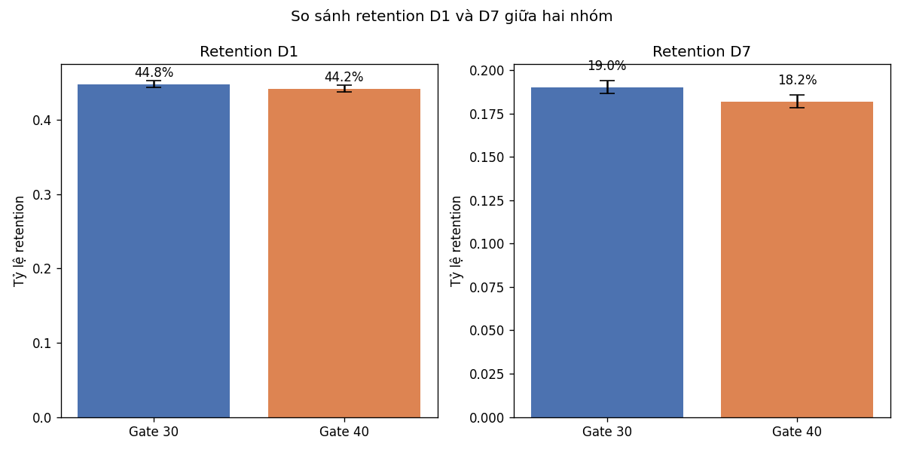
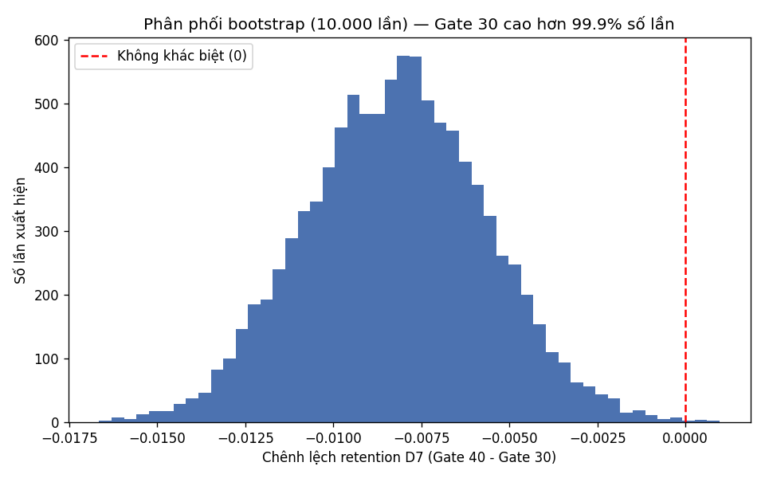
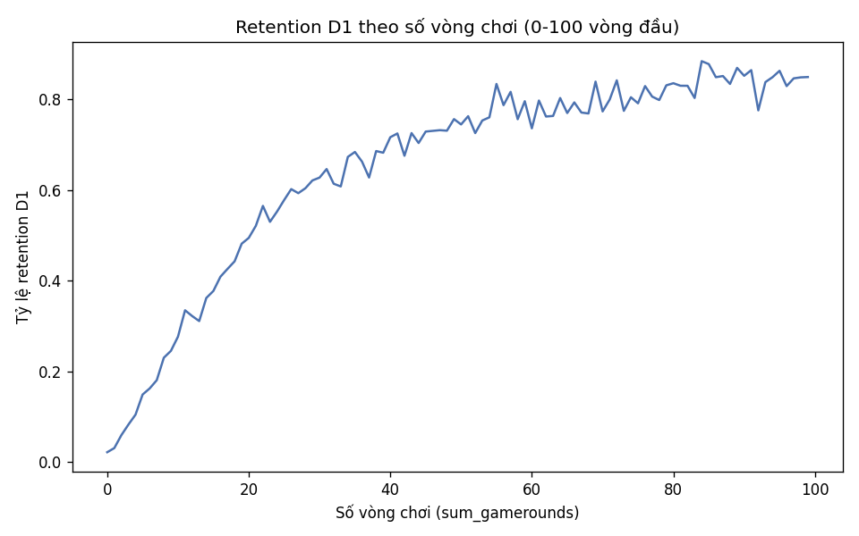

# Phân tích A/B Test Retention — Cookie Cats

Phân tích thử nghiệm A/B thật trên gần 90.000 người chơi của game mobile Cookie Cats, trả lời câu hỏi: **dời cổng chặn (gate) từ màn 30 sang màn 40 có giữ chân người chơi tốt hơn không?**

## Tóm tắt

Dữ liệu không ủng hộ việc dời gate. Ở mốc retention D7 (quay lại sau 7 ngày) — mốc quan trọng hơn cho quyết định dài hạn — nhóm giữ gate ở màn 30 có tỷ lệ quay lại cao hơn nhóm dời gate sang màn 40, chênh lệch này có ý nghĩa thống kê (kiểm định z, p = 0,0016) và được xác nhận độc lập bằng mô phỏng bootstrap 10.000 lần (gate_30 thắng thế ở 99,95% số lần mô phỏng). Ngược lại, mức độ gắn bó của người chơi (số vòng chơi trong 14 ngày) giữa hai nhóm gần như không khác biệt. **Đề xuất: giữ nguyên gate ở màn 30.**

## Bối cảnh

Gate là cổng chặn buộc người chơi chờ hoặc trả tiền để đi tiếp trong game. Đội sản phẩm thử nghiệm dời gate từ màn 30 sang màn 40 — tức cho người chơi trải nghiệm thoải mái hơn trước khi gặp rào cản đầu tiên, với giả thuyết rằng điều này sẽ giúp giữ chân người chơi tốt hơn. Bài phân tích này kiểm tra giả thuyết đó bằng dữ liệu thật.

## Dữ liệu

Bộ dữ liệu Cookie Cats (Kaggle), 90.189 người chơi, mỗi dòng một người:

| Cột | Nghĩa |
|---|---|
| `userid` | định danh người chơi |
| `version` | nhóm thử nghiệm: `gate_30` hoặc `gate_40` |
| `sum_gamerounds` | số vòng chơi trong 14 ngày đầu |
| `retention_1` | có quay lại sau 1 ngày |
| `retention_7` | có quay lại sau 7 ngày |

Hai nhóm có kích thước gần bằng nhau (gate_30: 44.700 người, gate_40: 45.489 người). Kiểm tra sample ratio mismatch (SRM) bằng chi-square cho p = 0,0086 — có ý nghĩa thống kê nhưng độ lệch tuyệt đối nhỏ (~0,87 điểm %), chưa đủ để nghi ngờ cơ chế chia nhóm ngẫu nhiên bị hỏng nghiêm trọng. Chi tiết đầy đủ về kiểm tra chất lượng dữ liệu và các quyết định xử lý (người chơi 0 vòng, giá trị cực đại nghi bot) xem tại [`docs/data_quality.md`](docs/data_quality.md).

## Phương pháp

Bốn bước phân tích, mỗi bước một notebook:

1. **[Khám phá và kiểm tra tính hợp lệ](notebooks/01_kham_pha.ipynb)** — kiểm tra dữ liệu trùng lặp, cân bằng nhóm, phân bố `sum_gamerounds`, xử lý giá trị bất thường.
2. **[Retention D1 và D7](notebooks/02_retention.ipynb)** — so tỷ lệ quay lại giữa hai nhóm ở cùng mốc thời gian, dùng kiểm định hai tỷ lệ (`proportions_ztest`, vì cỡ mẫu lớn nên xấp xỉ phân phối chuẩn hợp lý) và khoảng tin cậy 95%.
3. **[Bootstrap](notebooks/03_bootstrap.ipynb)** — mô phỏng lấy mẫu lại 10.000 lần để kiểm tra chéo kết quả kiểm định z bằng một phương pháp độc lập, không phụ thuộc giả định phân phối.
4. **[Mức độ gắn bó](notebooks/04_engagement.ipynb)** — so số vòng chơi giữa hai nhóm bằng **Mann-Whitney U** thay vì t-test, vì phân bố `sum_gamerounds` lệch phải rất mạnh (có outlier nghi bot chơi gần 50.000 vòng) khiến trung bình không đáng tin, kiểm định dựa trên trung bình sẽ bị outlier chi phối.

Mọi kiểm định đều báo kèm effect size bên cạnh p-value, vì có ý nghĩa thống kê không đồng nghĩa với đáng thay đổi quyết định.

## Kết quả

**Retention D1 và D7 theo nhóm:**

| Mốc | gate_30 | gate_40 | Chênh lệch | p-value | Ý nghĩa thống kê |
|---|---|---|---|---|---|
| D1 | 44,82% | 44,23% | -0,59 điểm % (tương đối -1,32%) | 0,0744 | Không |
| D7 | 19,02% | 18,20% | -0,82 điểm % (tương đối -4,31%) | 0,0016 | Có |

D1 không đủ bằng chứng thống kê để khẳng định có khác biệt. D7 thì có — và D7 phản ánh thói quen quay lại đã hình thành thực sự, đáng tin hơn D1 (dễ bị nhiễu bởi việc mở app tò mò một lần) làm căn cứ cho quyết định dài hạn như dời gate.

**Kiểm tra chéo bằng bootstrap** (10.000 lần lấy mẫu lại có hoàn lại trên retention D7):

Trong 10.000 lần mô phỏng, gate_30 có retention D7 cao hơn gate_40 ở **99,95% số lần** — một cách diễn giải trực quan, không cần hiểu p-value, nhưng cho đúng kết luận nhất quán với kiểm định z.

**Mức độ gắn bó (số vòng chơi) giữa hai nhóm gần như không khác biệt:** Mann-Whitney U cho p = 0,0502 (ngay sát ngưỡng 0,05) và effect size gần như bằng 0 (r = -0,0075). Nói cách khác, dời gate ảnh hưởng đến việc người chơi *có quay lại hay không* nhiều hơn là ảnh hưởng đến *chơi nhiều hay ít* ở những người vẫn còn chơi.

**Điểm rơi rụng người chơi:**

Tỷ lệ retention D1 tăng dốc từ ~2% (0 vòng) lên 80-85% khi số vòng chơi vượt ~60, sau đó gần như đi ngang. Vùng người chơi rời bỏ nhiều nhất là **0-20 vòng đầu tiên** — bất kể gate đặt ở màn nào.

## Đề xuất

**Giữ nguyên gate ở màn 30**, không dời sang màn 40. Hai phương pháp độc lập (kiểm định z + khoảng tin cậy, và mô phỏng bootstrap) cho cùng một kết luận ở mốc D7, làm tăng độ tin cậy của đề xuất so với chỉ dựa vào một phép kiểm định duy nhất.

Về sản phẩm, đáng đầu tư cải thiện trải nghiệm ở vùng 0-20 vòng chơi đầu tiên, vì đó là nơi mất người chơi nhiều nhất, không phụ thuộc vào vị trí gate.

Nếu có dữ liệu doanh thu (IAP), nên xét thêm liệu gate_40 (cho chơi thoải mái hơn) có bù lại bằng doanh thu tốt hơn không — bài phân tích này chỉ dựa trên retention, chưa có dữ liệu chuyển đổi trả phí.

## Giới hạn

- **Sample ratio mismatch nhẹ:** lệch nhóm 44.700/45.489 có ý nghĩa thống kê (p=0,0086) nhưng độ lớn nhỏ, cần lưu ý nhưng không phải rủi ro lớn.
- **Chỉ 14 ngày dữ liệu:** kết luận về D7 không suy rộng được cho D30 hay D90.
- **Quyết định giữ người chơi 0 vòng khi tính retention** (4,43% tổng số) — không có cách nào từ dữ liệu để biết đây là hành vi thật hay lỗi ghi nhận sự kiện; nếu đảo ngược quyết định này, các con số retention có thể tăng nhẹ ở cả hai nhóm.
- **Không có dữ liệu doanh thu:** đề xuất chỉ dựa trên retention, chưa đánh giá được tác động lên doanh thu (IAP/IAA).
- **Quan hệ giữa số vòng chơi và retention mang tính một phần tuần hoàn:** `sum_gamerounds` đếm cả 14 ngày, nên người được giữ lại đương nhiên có nhiều ngày hơn để cộng dồn vòng chơi — không tách bạch hoàn toàn được nhân quả.

---

Tài liệu bổ sung: [từ điển chỉ số retention/monetization](docs/tu_dien_chi_so.md) · [ghi chú chất lượng dữ liệu](docs/data_quality.md)
